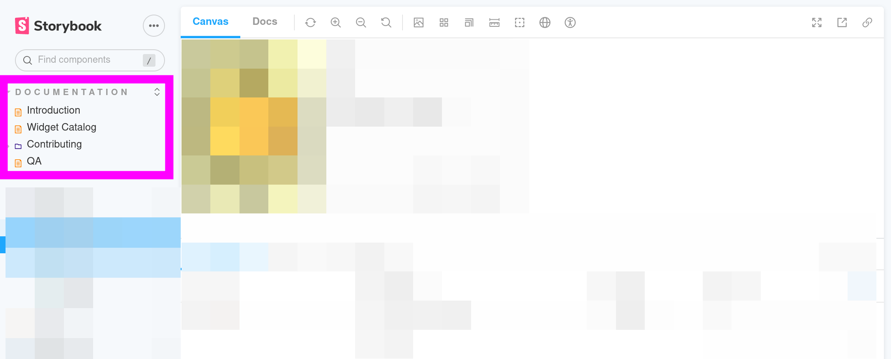

# Contribute Widgets to the Registry

If you haven't already, [follow the instructions to fork the repo](https://js-widgets.github.io/registry-starterkit-react/main/storybook/?path=%2Fstory%2Fdocumentation-configure-deployment--page).

Then pull the code locally. You can get the git instructions after pressing the green button _Code_.

Once you have a copy of the code in your machine, you will need to start Storybook. To do so execute:

```console
# Ensure the correct version of node.
# See https://github.com/nvm-sh/nvm#installing-and-updating to install nvm if necessary.
nvm install && nvm use

# Download all the project dependencies. You may need to install Yarn.
yarn install

# Add the following text using your editor.
echo 'PUBLIC_ASSETS_URL=/static' > .env.local
yarn compile

# Compiles Storybook in the current code base and shows the stories.
yarn storybook
```

This will open a browser page with Storybook in it. Storybook contains most of
the documentation on how to continue, so let's get over there.


